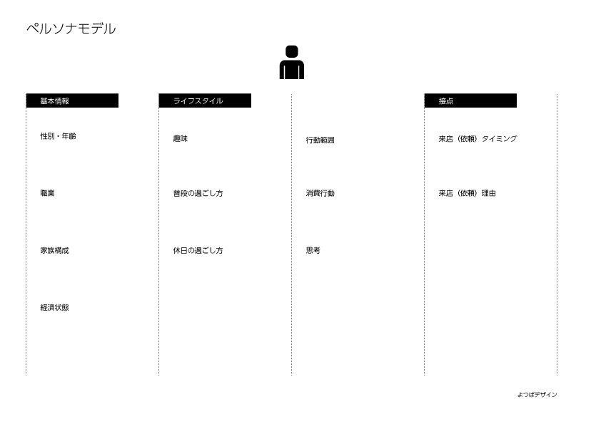
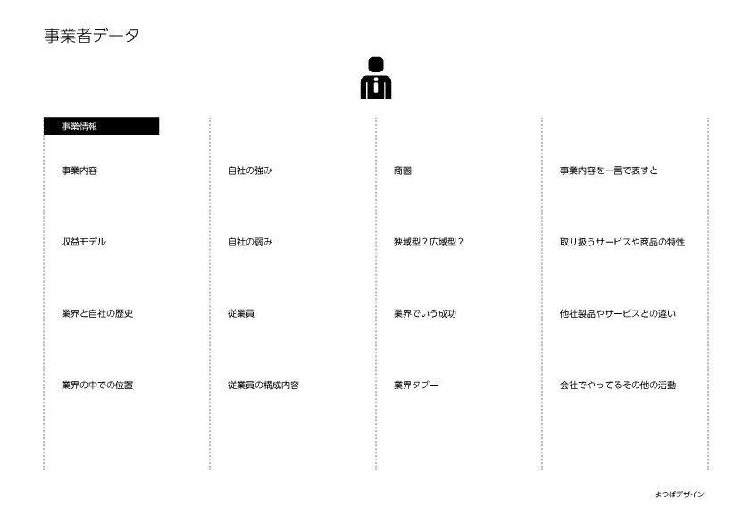
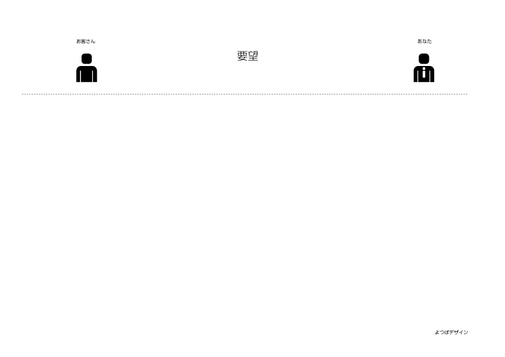

#打ち合わせ用の資料
課題解決や販売促進から制作に至るまでの打ち合わせ用資料。
状況に応じて質疑応答していましたが、汎用的な形でまとめたら便利でいろんな方も使えるかなと思い作りました。
ノウハウを共有する事によって、より使いやすいシート作りを目指します。
お客さんとのやりとりで、後から出てくるような事や「あれ聞いとけば良かった」みたいな事も少なくなり、より深いやりとりが早い段階で完了したらたぶんみんな幸せになれるはず。
これからやりたい人達や実際に現場にいる人達にとって役立つ資料となれば幸いです。

---

* [ミーティング用議題シート](agenda.md)
* [イメージ共有シート](impression.md)

---

* [ヒアリング](hearing.md)
* [ヒアリング（雑談）](hearing2.md)

---

既にWebサイトがある場合

* [改善のためのチェックリスト](improved.md)

---

* [ヒアリング〜提案までの流れ](proposal.md)
* [提案時のチェックリスト](checklist.md)

---

##種類別ヒアリングシート

* [ロゴ・マーク](logomark.md)
* [Web制作](website.md)
* [印刷物](print.md)

※分岐していく可能性があります。

---
###記入用シート

* [記入用シート(PDF)](img/tool.pdf )

---
記入用シート（画像）

---

よつばデザイン　後藤賢司
http://yotsuba-d.com